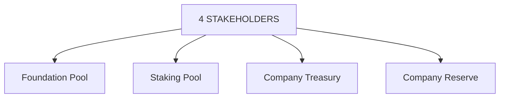

# The Platform

## 1. Mission

The mission of **SkyFleet Dash** is to create a competitive gaming platform where players can compete, win, and trade without centralized control. **SkyFleet Dash** empowers players with true ownership of their in-game assets through blockchain technology, enabling them to earn **SkyFleet Dash Tokens (SFDT)** and retain full control over their rewards and creations.

**SkyFleet Dash** believes that by addressing key challenges in the traditional gaming market, it can unlock new opportunities for players and creators alike. The current gaming market, especially in multiplayer and competitive gaming, suffers from a number of issues that hinder true player empowerment:

- *Centralized Ownership:*  
  Most gaming platforms restrict ownership of in-game assets, limiting what players can truly own or trade.

- *Restricted Trading:*  
  Traditional games often prevent players from selling or trading their earned assets on secondary markets, reducing the value of player achievements.

- *Lack of True Ownership:*  
  In traditional gaming, assets and in-game currency can be altered or removed without player consent, undermining player trust and the value of their investments.

- *Vulnerable Economies:*  
  Many game marketplaces rely on fiat currencies and centralized systems that are prone to fraud, credit card risks, and instability.

---

**SkyFleet Dash’s** mission is to solve these problems by providing a decentralized, transparent, and competitive gaming platform where players own their achievements and are rewarded fairly for their success. The platform will empower users by ensuring the value they generate in-game can be translated into real-world value through the **SkyFleet Dash Token (SFDT)** ecosystem.

## 2. The SkyFleet Dash Ecosystem

At its core, **SkyFleet Dash** is an ecosystem for players and creators, consisting of three main components: the *Asset Creator*, the *Marketplace*, and the *Competitive Game Platform*.

**SkyFleet Dash** offers players a unique way to create, customize, and trade digital assets. We empower users with intuitive, powerful content creation tools. Players can design their own spaceships, cosmic items, or other in-game elements, and sell them on the SkyFleet Dash marketplace. The *Asset Creator* is our dedicated tool that allows players to build and export their creations as digital assets, which can then be tokenized using the **SkyFleet Dash Token (SFDT)**.

These assets are securely stored on the blockchain, ensuring scarcity, security, and authenticity. Each asset is unique, indivisible, and can be traded or utilized in various games within the SkyFleet Dash platform.

---

### ◉ **True Digital Ownership**

By leveraging blockchain technology, **SkyFleet Dash** provides players with true digital ownership of their creations. This ensures that any asset a player creates or acquires can be freely traded or monetized without central control. **SkyFleet Dash** empowers players to benefit from the value they generate in the platform, creating a player-driven economy.

---

### ◉ **Cross-Platform Use and Programmability**

Assets created in **SkyFleet Dash** are not limited to a single game. By utilizing smart contracts, these assets can be used across different games and environments, making them highly versatile and valuable. The programmability of assets ensures that they can evolve and increase in value as players continue to use and trade them.

---

### ◉ **The Marketplace**

The **SkyFleet Dash Marketplace** serves as the trading hub for all player-generated assets. Players can buy, sell, or trade assets seamlessly with other members of the community. Whether they are selling spaceships, cosmic weapons, or rare collectibles, the marketplace is the heart of the **SkyFleet Dash** economy.

---

### ◉ **The Game Platform**

**SkyFleet Dash** is built around competitive gaming experiences where players can use their digital assets in real-time multiplayer modes. Players not only gain value through asset creation but also by competing in games where they can earn **SkyFleet Dash Tokens (SFDT)** and rare in-game rewards. The platform supports a play-to-earn model, allowing players to monetize their gaming efforts and engage in a growing economy.

## 3. Space and the Asset Map

In **SkyFleet Dash**, *Spaces* are blockchain-backed virtual tokens representing sectors of the SkyFleet universe. These Spaces allow players to own and control regions where they can host digital content, including assets like spaceships, avatars, and competitive game environments.

The **SkyFleet** universe is divided into distinct sectors, where players can explore, customize, and monetize their gameplay experience. Each *Space* is a unique territory that can be used to participate in high-stakes competitive gaming or to showcase player creations. Ownership of Space empowers players to publish custom game modes, compete in tournaments, and earn **SkyFleet Dash Tokens (SFDT)** from other players.

Spaces come with predefined characteristics and environments but can be customized and upgraded by their owners. Players can modify and terraform their Space to create strategic advantages or invite other players to collaborate on creating immersive game modes within their region.

---

### *Expanding the Universe*

In the future, **SkyFleet Dash** will introduce larger *Constellations* where players can combine multiple Spaces to form extensive territories. These Constellations will open up new collaborative gameplay modes, allowing multiple players to co-own regions, form alliances, and build powerful fleets together.

By owning *Space* within **SkyFleet Dash**, players gain full control over their in-game assets and opportunities to generate real-world value through competitions, trades, and custom events hosted in their Space.

[ Image of SkyFleet Territories and Universe Map]

## 4. Avatar

In **SkyFleet Dash**, an *Avatar* represents the player's in-game identity, which can be customized and modified to reflect the player’s personal style and strategy. Avatars come with a default set of animations and can perform various actions such as walking, running, jumping, and engaging in competitive activities.

Avatars are highly customizable, allowing players to modify them piece by piece—such as helmets, arms, torsos, and legs—by equipping them with different compatible asset tokens. These assets can be earned, traded, or purchased within the **SkyFleet Dash Marketplace**, allowing players to build unique avatars that enhance both their visual identity and gameplay performance.

Players can upgrade their avatars with specialized gear, cosmic armor, or high-tech enhancements, increasing their competitiveness in tournaments and multiplayer matches.

[image of SkyFleet Dash Avatar Customization]

## 3.5. SkyFleet Dash Stakeholders

**SkyFleet Dash** has established a four-stakeholder model to ensure the success of the platform and the equitable distribution of revenue. Through smart contracts, revenues generated on the platform will be allocated across these four stakeholders to support the growth of both the creator and player ecosystems, as well as to provide the necessary resources to develop high-quality gaming experiences.

---

### **Foundation Pool:**

The Foundation Pool ensures that a portion of the revenue generated by **SkyFleet Dash** is redistributed to support ecosystem growth. Funds from this pool are used to incentivize game creators, developers, and community-driven projects. Over time, the Foundation Pool will be progressively decentralized, transitioning to a DAO-driven model to allow the community to have a greater say in how these resources are allocated.

---

### **Staking Pool:**

The Staking Pool is designed to reward **SFDT** holders who stake their tokens. Players who actively lock their tokens in smart contracts will earn additional yield, providing passive income while supporting the platform’s stability. The governance of the Staking Pool will initially be managed centrally but will migrate to a DAO mechanism over time, ensuring that the community has control over staking rewards and distribution.

---

### **Company Treasury:**

The Company Treasury represents the portion of **SFDT** generated through the sale of company-owned assets. Funds held in the treasury will be used to cover operational expenses and will be subject to a lock-up period to ensure the long-term sustainability of the platform. Once unlocked, these tokens will be sold back to the market, ensuring liquidity while maintaining the value of **SFDT**.

---

### **Company Reserve:**

The Company Reserve is the initial pool of tokens held by **SkyFleet Dash**, representing 20% of the total token supply. These tokens will be locked for a six-month period and will be used to support long-term projects and partnerships. The reserve will be replenished through the sale of company-owned assets and will ensure that **SkyFleet Dash** has the resources to scale and grow sustainably.

## 6. SkyFleet Dash Revenue Streams

**SkyFleet Dash** has five primary revenue streams where players and creators exchange **SkyFleet Dash Tokens (SFDT)**. The revenue generated through these streams will be allocated as follows:

---
| **Revenue Stream**                     | **Allocation** |
|----------------------------------------|----------------|
| **Space Sales**                        | 50% locked for 12 months, after which proceeds from the sale of Spaces will go to the Company Treasury. |
| **Company NFT Sales**                  | 25% transferred to the Company Reserve with a 6-month lock-up period. |
| **Player Subscriptions & Services**    | 25% transferred to the Foundation to support the growth of the token ecosystem. |
| **Transaction Fees (5% of any SFDT transaction)** | *Transaction Fees are restructured as 5% of all transaction volume carried out in SFDT, including but not limited to:* • Sales and rental transactions of Spaces (from SkyFleet Dash to players and player-to-player in the marketplace). • NFT transactions (from SkyFleet Dash to players and player-to-player in the marketplace). • Peer-to-peer in-game payments (e.g., entrance fees for game modes or tournaments). • Player subscription fees and advertising revenue.  **Allocation of Transaction Fees:** • 50% to the Staking Pool as rewards for players who stake SFDT. • 50% to the Foundation to support the development and growth of the ecosystem. |
| **Advertising Revenue**               | 25% allocated to the Staking Pool as rewards for token holders; 75% allocated to the Foundation. |
---

## 7. Benefits

SkyFleet Dash’s decentralized blockchain-based gaming platform provides numerous benefits compared to traditional, non-blockchain gaming systems. These advantages are listed in the chart below:

---
| **Category** | **With Blockchain** (SkyFleet Dash) | **Without Blockchain** (Roblox & Minecraft) |
|-------------|------------------------------------------|------------------------------------------------|
| **Based on Ownership** | • **TRUE OWNERSHIP** Players have perpetual ownership of their in-game assets. Even if SkyFleet Dash were to shut down, players can still hold, sell, or trade their assets. | • **LIMITED OWNERSHIP** The assets are controlled by the game platform. Players do not truly own their assets, and they lose access if the platform shuts down. |
| **Based on Security** | • **SECURE** Assets are recorded on a distributed ledger, ensuring ownership is transparent and cannot be altered. This reduces the risks of fraud and theft. | • **INSECURE** The assets are stored in a centralized server, making them susceptible to hacking, loss of data, or fraud. There is no guarantee of asset security. |
| **Based on Revenue Share** | • **FAIR REVENUE SHARE** – Creators receive 100% of the price they set for assets – Multiple creators can easily share revenue through smart contracts. | • **LIMITED REVENUE SHARE** – Creators receive only partial payment for items they sell. – Ownership limited to a single player or entity. |
| **Based on Trading Freedom** | • **DECENTRALIZED TRADING** Players have complete freedom to trade their in-game assets on primary and secondary markets without restrictions. Players decide how, when, and with whom they want to trade, sell, or gift their items. | • **CENTRALIZED TRADING** Trading is limited and controlled by the game developers. Often, items cannot be sold or traded freely, and players may lose their assets if there are changes in the game rules or if the platform ceases. |
| **Based on Cross-Application Interoperability** | • In-game assets can be used across multiple games or environments within the SkyFleet Dash ecosystem. This breaks the traditional limitations of assets being bound to a single game. | • In-game assets are exclusive. Players cannot transfer or use these assets outside the game, restricting their value and potential use. |
----