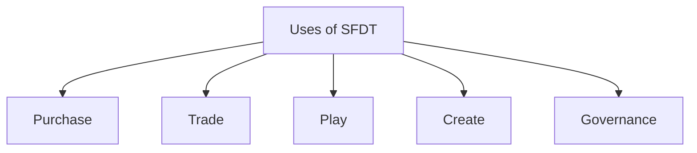

# Tokenomics

## 1. What is SkyFleet Dash Token (SFDT) and What is it Used For?

**SkyFleet Dash Token (SFDT)** is the core utility and governance token in the SkyFleet Dash ecosystem, designed to fuel both the platform’s in-game economy and governance.  
*Through SFDT, SkyFleet Dash provides players, investors, and the community with opportunities to engage actively, make key decisions, and benefit from the platform’s long-term growth.*

---

### Key Uses of SFDT:

- **Access the SkyFleet Dash Platform:**  
Players use SFDT to enter competitive games, buy in-game items such as spaceships, weapons, and equipment, or upgrade their game avatars. As players participate in matches and tournaments, they have the opportunity to earn more SFDT as rewards for their performance.

- **Governance:**  
SFDT holders can participate in the governance of SkyFleet Dash through a decentralized autonomous organization (DAO) structure. Token holders can vote on key decisions such as game feature implementations, platform upgrades, and other major development plans.  
Players can also delegate their voting power to others if they choose.

- **Staking:**  
SFDT tokens can be staked by players to earn passive income. By staking SFDT, players can generate returns, and it also gives them access to premium rewards and other exclusive in-game benefits.  
Staking is an essential way for players to maximize the utility of their earned tokens.

- **Transaction Fees and Revenue Sharing:**  
A percentage of all transaction fees (5%) generated on the platform is redistributed among SFDT holders. Half of these fees go towards the staking pool to reward those who stake their tokens, while the other half goes to maintaining and developing the platform.

- **Foundation Support:**  
The SkyFleet Dash Foundation plays a crucial role in growing the ecosystem by offering grants and funding projects that enhance the platform.  
The foundation supports both game creators and community-driven initiatives, driving innovation and ensuring the platform continues to grow in value.
---
## Use Case for SkyFleet Dash Token (SFDT)

### ◉ Purchase:
- *Services:* Players can use SFDT to purchase in-game services such as avatar upgrades, exclusive game modes, or special access to tournaments.

### ◉ Trade:
- *Spaces:* Players can trade and purchase game environments (Spaces) where they can customize and host their own tournaments.  

- *Assets:* In-game items, such as spaceships, cosmic gear, and weaponry, can be bought and sold using SFDT.  

- *Resources:* Special materials and resources for crafting new assets or upgrading existing ones are available through the marketplace.

### ◉ Play:
- *Games:* Players use SFDT to enter high-stakes multiplayer tournaments or to unlock new game modes. Players can also earn SFDT as rewards for victories and achievements.

### ◉ Create:
- *Game Content:* Users can create custom game content and assets, which can be tokenized and sold within the SkyFleet Dash ecosystem.  

- *Assets:* Custom-designed assets (like spaceships, avatars, or equipment) can be uploaded and sold on the marketplace, allowing creators to monetize their efforts.

### ◉ Governance:
- *Votes:* SFDT holders can vote on platform governance, influencing the future development of SkyFleet Dash.  

- *Staking:* Players can stake SFDT tokens to earn passive income and gain voting rights.  

- *Curation:* Users can participate in curation and content review, contributing to the quality and diversity of the SkyFleet Dash ecosystem.

---

----

## 2 Token Distribution and Allocation

The total supply of SFDT is fixed at **1 billion tokens**. The token allocation aims to balance growth, community incentives, and platform sustainability, distributed as follows:

---

### 1. Public and Private Sales: 20% (200 million SFDT)
- **Private Sale: 10% (100 million SFDT)** – Distributed to early investors at a discount to raise initial funding.  
- **Public Sale (Launchpad): 10% (100 million SFDT)** – Offered to retail investors through a public sale on a reputable launchpad platform to build community support and raise additional capital.

---

### 2. Team and Advisors: 15% (150 million SFDT)
- Allocated to founders, core team members, and advisors who are integral to the project’s success.  
- Vesting is applied to ensure commitment and prevent immediate token sell-off after launch.

---

### 3. Community and Ecosystem Incentives: 30% (300 million SFDT)
- Reserved for in-game rewards, staking incentives, and community development.  
- These tokens will be gradually released to reward player engagement, community contributions, and encourage long-term participation.

---

### 4. Liquidity Pool for Exchanges: 10% (100 million SFDT)
- Used to provide liquidity on decentralized and centralized exchanges, ensuring smooth trading and price stability.  
- This allocation supports market depth and availability, making it easy for players and investors to trade SFDT.

---

### 5. Partnerships and Marketing: 10% (100 million SFDT)
- Allocated to partnerships, marketing efforts, and collaborations with other platforms.  
- Helps expand the ecosystem, attract new users, and support marketing campaigns that increase token awareness and adoption.

---

### 6. Reserve Fund: 15% (150 million SFDT)
- Held as a strategic reserve for future development, emergency funding, or unexpected needs.  
- This reserve ensures long-term financial stability and can be used to support the ecosystem in changing market conditions.
-----
## 6.3 Token Release and Vesting Schedule

To ensure stability and sustainable growth, SFDT follows a structured release schedule:

| **Allocation**                      | **Percentage** | **Token Amount** | **Vesting Details**                                                   |
|------------------------------------|----------------|------------------|------------------------------------------------------------------------|
| **Public Sale**                    | 10%            | 100 million      | Immediate release at launch                                            |
| **Private Sale**                   | 10%            | 100 million      | 6-month cliff, vesting over 6 month                                     |
| **Team Allocation**                | 10%            | 100 million      | 1-year cliff, vesting over 2 years                                     |
| **Advisors**                       | 5%             | 50 million       | 6-month cliff, vesting over 1 year                                     |
| **Staking and Rewards**           | 15%            | 150 million      | Gradual release over 5 years based on staking demand                   |
| **Game Rewards & Incentives**      | 15%            | 150 million      | Distributed as rewards based on gameplay achievements and events       |
| **Exchange Liquidity**             | 10%            | 100 million      | Released at launch for DEX and CEX liquidity                           |
| **Development Fund**               | 10%            | 100 million      | Gradual release over time based on development milestones              |
| **Partnerships & Collaborations**  | 10%            | 100 million      | Released based on partnership agreements and promotional activities    |
| **Community Reserve**              | 5%             | 50 million       | Used for community building, airdrops, and promotional campaigns       |
----
## 4 Token Value Management

**Initial Token Price**: $0.10 per SFDT  

**Initial Circulating Supply**: 10% of total supply (100 million SFDT tokens)

**Initial Market Cap**:  
With an initial circulating supply of 100 million tokens and a price of $0.10 per token, the initial market capitalization at launch would be **$10 million**.

**Fully Diluted Market Cap**:  
Based on the total supply of 1 billion tokens, the fully diluted market cap would be **$100 million**.

| **Aspect**               | **Description**                                                                 |
|--------------------------|----------------------------------------------------------------------------------|
| **Initial Token Price**  | $0.10 per SFDT                                                                  |
| **Initial Market Cap**   | $10 million (based on initial circulating supply)                               |
| **Fully Diluted Market Cap** | $100 million                                                              |
| **Revenue Sources**      | Transaction fees, in-game purchases, tournament fees, NFT sales, partnerships, staking fees |
| **Staking Options**      | Standard staking pool, tiered staking with variable yields based on lock-up duration |
| **Yield Rates**          | 8–15% APY (standard), up to 20% for long-term lock-ups                          |
| **Reward Distribution**  | Monthly rewards in SFDT or GC, with reinvestment option for compounding returns |
| **Community Rewards**    | Additional bonuses for governance participation and loyalty-based incentives    |

> This tokenomics model is designed to support SkyFleet Dash’s ecosystem, balancing user rewards with sustainable revenue streams and supply management, thereby enhancing the long-term value of SFDT.

## 5 Revenue Model and Economic Sustainability

SkyFleet Dash’s dual-token model supports revenue growth and economic sustainability. Key revenue streams include:

- **In-Game Purchases**: SFDT is utilized for exclusive items, event access, and competitive tournament entries, driving ecosystem engagement and in-game purchases.

- **Staking Rewards and Transaction Fees**: SFDT staking yields additional rewards, while transaction fees from token conversions add to platform revenue.

- **Partnerships and Sponsorships**: Brand partnerships and sponsored events involving SFDT further extend its utility and value.

These mechanisms collectively ensure that the SkyFleet Dash ecosystem remains self-sustaining, with balanced supply and demand dynamics that support token value while fostering long-term engagement.

> This tokenomics structure underscores SFDT’s utility, promotes long-term participation, and enhances token stability, solidifying SkyFleet Dash as a decentralized and community-driven gaming ecosystem.

